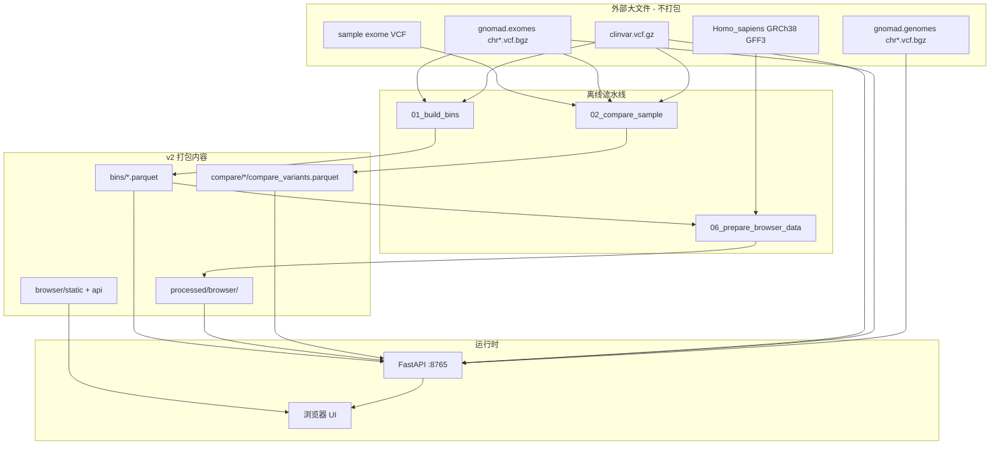

# 交互式外显子景观浏览器 v2 — 复现与解读指南

本文档描述 **exome_baseline interactive browser v2** 的完整交付物、数据依赖、重建流程、界面功能与 API，用于在其他服务器上复现并解读结果。

---

## 1. 版本概述

v2 是在 gnomAD exome baseline 静态 SVG 之上的 **Web 交互浏览器**：

| 组件 | 技术 |
|------|------|
| 后端 | FastAPI + `BrowserDataStore`（`scripts/_browser_viewport.py`） |
| 前端 | 原生 HTML/CSS/JS（`browser/static/`） |
| 数据 | 预聚合 bins + GFF3 基因 + ClinVar 实时切片 + 样本 compare parquet |

### 1.1 轨道（自上而下）

1. **Ideogram** — UCSC 细胞遗传学条带，可拖拽选区  
2. **Ruler** — 基因组坐标刻度  
3. **Genes** — Ensembl GFF3 外显子  
4. **gnomAD_exome** — gnomAD v4.1 exomes 变异密度柱（蓝）  
5. **ClinVar** — 致病 / VUS / 良性堆叠柱（高度 ×2）  
6. **Sample（如 HG002）** — known（灰）+ novel（橙）堆叠柱  
7. **样本 bin 详情表** — 点击样本柱后，表格展示该 bin 内变异；可排序、可生成 PDF 报告  

### 1.2 与 v1（静态 SVG）的区别

| 能力 | 静态 SVG | v2 浏览器 |
|------|----------|-----------|
| 缩放 / 平移 | 无 | 有 |
| 样本轨 | 全基因组 tick 图 | 分辨率自适应堆叠 bin |
| ClinVar / gnomAD 悬停 | 有限 | 多行 tooltip + 统计字段 |
| 变异详情 | 无 | 表格 + PDF 报告按钮 |
| 运行方式 | 生成文件 | `browser/run_api.sh` 常驻服务 |

---

## 2. 架构



---

## 3. 获取 v2 打包文件

在源服务器项目根目录执行：

```bash
cd /path/to/exome_baseline
bash scripts/09_package_browser_v2.sh
```

产出：

| 路径 | 说明 |
|------|------|
| `releases/interactive_browser_v2/exome_baseline_browser_v2/` | 解压即用目录树 |
| `releases/interactive_browser_v2/exome_baseline_browser_v2_YYYYMMDD.tar.gz` | 压缩包 |
| 包内 `README.md` | 本文档副本 |
| 包内 `EXTERNAL_FILES.txt` | 未打包的大文件清单（仅文件名） |
| 包内 `BUNDLE_FILELIST.txt` | 包内所有文件及大小 |

典型压缩包体积约 **15–25 MB**（含 bins、基因 parquet、HG002 compare、样本 VCF 等）。

---

## 4. 包内目录结构

```
exome_baseline_browser_v2/
├── README.md                          # 本文档
├── VERSION.txt
├── EXTERNAL_FILES.txt                 # 外部大文件列表
├── BUNDLE_FILELIST.txt
├── manifest.json                      # Phase-1 全基因组 bin 清单
├── browser/
│   ├── api/main.py                    # FastAPI 入口
│   ├── run_api.sh / stop_api.sh
│   ├── requirements.txt
│   └── static/                        # 前端资源
├── scripts/                           # 流水线与 viewport 逻辑
├── bins/                              # gnomAD+ClinVar 预聚合
│   ├── by_chrom/chr*_bins_{1mb,100kb,10kb}.parquet
│   └── genome_bins_*.parquet
├── processed/browser/
│   ├── manifest.json                  # 浏览器 API 清单（必需）
│   ├── cytobands.json
│   ├── genes/chr*_genes.parquet
│   └── report_cache/                  # PDF 缓存（可空）
├── compare/
│   ├── HG002/compare_variants.parquet
│   ├── HG002/compare_summary.json
│   └── p0001/...
└── raw/
    ├── cytoBand.txt
    └── samples/HG002_exome.vcf.gz ...
```

---

## 5. 外部大文件（不打包，仅列文件名）

部署前需在目标机准备以下文件，并在 `scripts/_config.py` 中配置绝对路径（参考 `scripts/_config.example.py`）。

### 5.1 gnomAD v4.1 exomes（必需 — 全量重建、compare、bin 详情、PDF）

每个染色体一对文件（共 24 条染色体）：

```
gnomad.exomes.v4.1.sites.chr1.vcf.bgz
gnomad.exomes.v4.1.sites.chr1.vcf.bgz.tbi
gnomad.exomes.v4.1.sites.chr2.vcf.bgz
...
gnomad.exomes.v4.1.sites.chr22.vcf.bgz
gnomad.exomes.v4.1.sites.chrX.vcf.bgz
gnomad.exomes.v4.1.sites.chrY.vcf.bgz
```

默认目录：`GNOMAD_EXOMES_VCF_DIR`（源环境示例：`/mnt/data2/0_database/gnomAD/4.1/vcf/exomes/`）。  
全量约 **~185 GB**。

### 5.2 gnomAD v4.1 genomes（推荐 — Source 列 **G** 徽章、PDF 中 genomes 频率）

```
gnomad.genomes.v4.1.sites.chr{N}.vcf.bgz
gnomad.genomes.v4.1.sites.chr{N}.vcf.bgz.tbi
```

目录：`GNOMAD_GENOMES_VCF_DIR`。

### 5.3 ClinVar（必需 — ClinVar 轨、compare 分类）

```
clinvar.vcf.gz
clinvar.vcf.gz.tbi
```

### 5.4 Ensembl GFF3（仅重建基因轨时需要）

```
Homo_sapiens.GRCh38.115.gff3
```

若使用包内已有的 `processed/browser/genes/*.parquet`，可跳过 GFF3。

### 5.5 其他可选

| 文件 | 用途 |
|------|------|
| `gnomad.v4.1.constraint_metrics.tsv` | 变异报告 PDF 中的基因约束 |
| `HG002_GRCh38_benchmark.vcf.gz` | 仅当用 `05_prepare_giab_sample.py` 重新生成 HG002 外显子 VCF |

---

## 6. 环境准备

### 6.1 系统要求

- Linux，Python **3.10+**
- 可访问上述 VCF/GFF3 路径（NFS 或本地拷贝）
- 建议内存 ≥ 8 GB；首次 PDF 生成会读 gnomAD 区间

### 6.2 Python 依赖

```bash
cd exome_baseline_browser_v2

# 浏览器 API
pip install -r browser/requirements.txt

# 流水线（重建 bins / compare）
pip install -r scripts/requirements-pipeline.txt

# 变异报告 PDF（表格内 Baseline PDF / Sample PDF 按钮）
pip install -r scripts/requirements-variant-report.txt
```

| 包 | 用途 |
|----|------|
| fastapi, uvicorn | Web 服务 |
| pandas, pysam | 流水线 + viewport |
| fpdf, cairosvg | PDF 报告渲染 |

### 6.3 配置路径

`ROOT` 由 `scripts/_config.py` 自动解析为项目根目录（`Path(__file__).parent.parent`），解压后无需改 `ROOT`。在新服务器上编辑 `scripts/_config.py` 中的外部路径（或参考 `scripts/_config.example.py`）：

```python
GNOMAD_EXOMES_VCF_DIR = Path(".../gnomad/4.1/vcf/exomes")
GNOMAD_GENOMES_VCF_DIR = Path(".../gnomad/4.1/vcf/genomes")
CLINVAR_VCF = Path(".../clinvar.vcf.gz")
GFF3 = Path(".../Homo_sapiens.GRCh38.115.gff3")  # 仅重建基因轨时需要
CONSTRAINT_TSV = Path(".../gnomad.v4.1.constraint_metrics.tsv")  # 可选
```

完整外部文件名列表见包内 `EXTERNAL_FILES.txt`（共 116 行，含 24 条染色体 gnomAD exomes/genomes 的 `.vcf.bgz` 与 `.tbi`）。

## 7. 复现流程

### 7.1 快速启动（使用包内预计算数据）

适用于验证部署、演示 UI，**不需要**重跑 gnomAD 全基因组 bin 构建。

```bash
# 1. 配置 scripts/_config.py 中 gnomAD / ClinVar 路径（供 live 轨道与 PDF）
# 2. 确认存在：
test -f processed/browser/manifest.json
test -f compare/HG002/compare_variants.parquet

# 3. 冒烟测试
python3 scripts/07_test_browser_viewport.py

# 4. 启动服务
bash browser/run_api.sh
# 浏览器打开 http://127.0.0.1:8765/
```

远程访问需 SSH 端口转发：`ssh -L 8765:127.0.0.1:8765 user@server`

### 7.2 全量重建（从零）

```bash
export ROOT=/your/deploy/exome_baseline_browser_v2
cd "$ROOT"

# Step 1 — gnomAD+ClinVar bins（耗时最长，依赖 exomes VCF）
# 编辑 scripts/01_build_bins.sh 中 ROOT= 或使用 _config.ROOT
bash scripts/01_build_bins.sh
# → bins/by_chrom/*, bins/genome_bins_*, manifest.json

# Step 2 — 样本 VCF（二选一或都要）
# HG002 外显子 VCF（若已有 raw/samples/HG002_exome.vcf.gz 可跳过）
python3 scripts/05_prepare_giab_sample.py ...

# 演示样本 p0001
python3 scripts/00_generate_sample_vcf.py ...

# Step 3 — 样本 vs baseline compare
python3 scripts/02_compare_sample.py \
  --sample-vcf raw/samples/HG002_exome.vcf.gz \
  --sample-id HG002

python3 scripts/02_compare_sample.py \
  --sample-vcf raw/samples/p0001.vcf.gz \
  --sample-id p0001

# Step 4 — 浏览器专用层（基因、cytoband、manifest）
python3 scripts/06_prepare_browser_data.py --chrom all

# Step 5 — 测试 + 启动
python3 scripts/07_test_browser_viewport.py
bash browser/run_api.sh
```

### 7.3 仅新增一个样本

在已有 bins 与 `processed/browser/manifest.json` 前提下：

```bash
python3 scripts/02_compare_sample.py \
  --sample-vcf /path/to/new_sample.vcf.gz \
  --sample-id NEW_ID

python3 scripts/06_prepare_browser_data.py --chrom all   # 刷新 samples 列表
bash browser/run_api.sh
```

浏览器通过 `?sample=NEW_ID` 或后续扩展的样本选择器加载新轨。

---

## 8. 启动与 API

### 8.1 启动 / 停止

```bash
bash browser/run_api.sh          # 默认 127.0.0.1:8765
PORT=9000 bash browser/run_api.sh
bash browser/stop_api.sh
```

### 8.2 HTTP 接口

| 方法 | 路径 | 说明 |
|------|------|------|
| GET | `/` | 前端页面 |
| GET | `/api/health` | 健康检查 |
| GET | `/api/manifest` | 染色体、样本、轨道元数据 |
| GET | `/api/chrom/{chrom}/meta` | 单条染色体信息 |
| GET | `/api/chrom/{chrom}/viewport?start=&end=&sample=` | 视口内全部轨道数据 |
| GET | `/api/chrom/{chrom}/sample/{id}/bin-variants?bin_start=&bin_end=` | 样本 bin 变异表 |
| GET | `/api/variants/{variant_id}/report/reference.pdf` | 英文 baseline 报告 PDF |
| GET | `/api/variants/{variant_id}/report/sample.pdf?sample_id=` | 英文 sample 对比报告 PDF |

`variant_id` 格式：`1-16051552-G-T`（gnomAD 风格，无 `chr` 前缀）。

---

## 9. 界面操作与解读

### 9.1 导航

- **染色体按钮**：chr1–22, X, Y（数字排序）  
- **Location 输入**：如 `chr21:25,800,000-26,200,000`  
- **缩放 ±**：按 manifest 中 `zoom_steps_bp` 阶梯缩放  
- **Ideogram 拖拽**：选择视口范围  

### 9.2 轨道解读

| 轨道 | 含义 | 柱高 |
|------|------|------|
| gnomAD_exome | 人群外显子变异密度 | 与视口内 bin 变异数成正比；悬停见 SNV/Indel/Rare/Common |
| ClinVar | 临床注释变异 | P/LP（红）、VUS（黄）、Benign（绿）堆叠 |
| Sample | 个体相对 baseline | 灰 = 在 gnomAD/ClinVar 已知；橙 = novel |

分辨率随视口宽度自动切换（见 API 返回的 `resolutions.gnomad_bp` / `clinvar_bp`）。

### 9.3 样本 bin 详情表

1. 点击 **样本轨** 任意柱  
2. 表格紧贴样本轨下方展开，占满页面剩余高度  
3. **列说明**：

| 列 | 含义 |
|----|------|
| Variant ID | gnomAD 变异 ID，链至 gnomAD 页面 |
| Source | **E** = gnomAD exomes；**G** = 同时存在于 genomes VCF |
| HGVS Consequence | 主转录本 HGVS（c./p.） |
| VEP Annotation | 主要后果类型（带颜色圆点） |
| Germline classification | ClinVar 致病性等 |
| Allele Count/Number/Frequency | gnomAD exomes AC/AN/AF |
| report | **Baseline PDF** / **Sample PDF**（英文） |

4. 点击列名可排序（report 列除外）  
5. 切换染色体或缩放会清空当前选中 bin  

### 9.4 示例位点

| 坐标 | 说明 |
|------|------|
| `chr1:16,050,000-16,052,000` | HG002 CLCNKB 已知变异 |
| `chr21:25,800,000-26,200,000` | APP 基因区 |

---

## 10. 关键脚本说明

| 脚本 | 作用 |
|------|------|
| `01_build_bins.py` | 流式读 gnomAD exomes VCF，写多分辨率 parquet |
| `02_compare_sample.py` | 样本 VCF vs gnomAD+ClinVar → `compare_variants.parquet` |
| `06_prepare_browser_data.py` | GFF3 基因、cytoband、`processed/browser/manifest.json` |
| `_browser_viewport.py` | 视口聚合、轨道 JSON |
| `_browser_sample.py` | 样本 bin + 详情表字段（含 E/G source） |
| `_browser_reports.py` | 按需生成 PDF 并缓存至 `processed/browser/report_cache/` |
| `07_test_browser_viewport.py` | 无 uvicorn 冒烟测试 |
| `09_package_browser_v2.sh` | 生成本复现包 |

---

## 11. 故障排查

| 现象 | 处理 |
|------|------|
| 页面 Loading 后空白 | 检查 `processed/browser/manifest.json` 是否存在 |
| `curl /api/health` 无响应 | 确认 `run_api.sh` 在运行；端口 8765 |
| ClinVar 轨为空 | `CLINVAR_VCF` 路径与 tabix 索引 |
| 样本轨无柱 | `compare/{id}/compare_variants.parquet` 缺失或 `sample=` 参数错误 |
| bin 表无 VEP/AF | 对应染色体 gnomAD exomes VCF 不可读 |
| Source 无 G | genomes VCF 未配置或该位点不在 genomes |
| PDF 按钮失败 | 安装 `requirements-variant-report.txt`；查看 API 返回的 500 detail |
| `06_prepare_browser_data` 失败 | 可仅使用包内 `cytobands.json` + `genes/`，跳过 GFF3 步骤 |

---

## 12. 数据流与 compare 语义

```
样本 VCF 位点
    ↓ 02_compare_sample（逐位点查 gnomAD exomes + ClinVar）
compare_variants.parquet
    ├── match_status: known_gnomad | known_gnomad_clinvar | novel_in_sample | ...
    ├── is_novel: bool
    └── gnomad_af, clinsig, clinical_tier, ...
    ↓ _browser_sample（按 ClinVar 分辨率分 bin）
样本轨 known/novel 堆叠柱
    ↓ 点击 bin → _browser_sample.load_sample_bin_variant_details
详情表 + 可选 PDF（_variant_report.py）
```

**novel** 定义：在 gnomAD exomes 与 ClinVar 均未见该等位基因（与 compare 流水线一致）。

---

## 13. 版本记录

| 项 | 内容 |
|----|------|
| 版本名 | interactive_browser_v2 |
| 参考基因组 | GRCh38 |
| gnomAD | v4.1 exomes（主 baseline）+ genomes（Source G / PDF 补充） |
| 默认样本 | HG002（GIAB 外显子） |
| 默认染色体 | chr21 |
| 打包脚本 | `scripts/09_package_browser_v2.sh` |

---

## 14. 相关文档

- 变异报告 schema：`docs/VARIANT_REPORT_DESIGN.md`（若随项目分发）  
- 全项目规划：`PROJECT_PLAN.md`  

如有路径或样本定制需求，优先修改 `scripts/_config.py` 后重跑第 7 节对应步骤。
